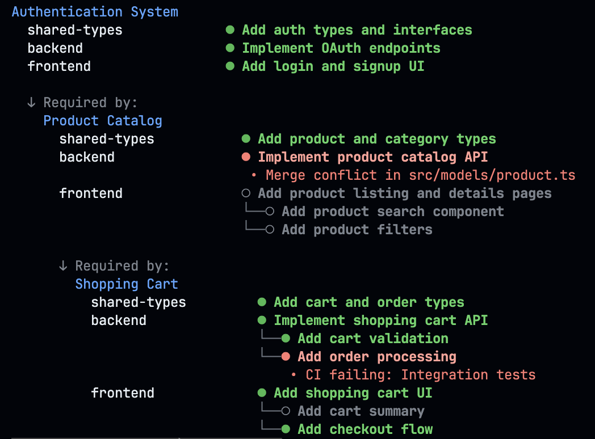

# 🔄 PRStuck - Where Stuck meets Stack!

Stuck with messy PR stacks? Can't untangle your PR dependencies? PRStuck is your escape hatch and stacking companion, all in one! Get unstuck and stack smarter! 🎯

## ✨ Why PRStuck?

- 🚨 **Get Unstuck**: Instantly spot conflicts and CI fails blocking your PRs
- 📚 **Stack Better**: Master your stacked PRs with dependency tracking
- 🔗 **Stack Together**: Track related PRs across repos like a pro
- 💡 **Smart Stacking**: Get suggestions for optimal PR stacking order _(Coming Soon)_



## 🚀 Quick Start

```bash
# Install the extension
gh extension install baruchiro/gh-prstuck

# Check what's blocking your PRs
gh prstuck stuck

# Organize your PRs into features
gh prstuck list

# Manage feature dependencies
gh prstuck features
```

## 🎮 Commands

### Available Now

- `gh prstuck stuck` - Find out what's keeping your PRs stuck
- `gh prstuck list` - Interactive UI to organize PRs into features
  - Press `a` to view your authored PRs
  - Press `r` to view PRs where you're requested as reviewer
  - Press `s` to view PRs assigned to you
  - Navigate with ↑/↓ arrows
  - Press Enter to select a PR
  - Choose existing feature or create new one
  - Press Esc to save and exit
- `gh prstuck features` - Manage feature hierarchies and dependencies
  - Navigate with ↑/↓ arrows
  - Press Enter to manage a feature's dependencies
  - Press Space to toggle dependencies
  - Press Esc to save and return
  - Create new features with no PRs

## 🛠 Tech Stack

- Node.js - For the core engine
- GitHub API - Your window to the PR world
- Ink - Making your terminal beautiful
- React - For smooth interactive experiences

## 💡 Pro Tips

- Keep your PRs stacked, not stuck! 📚
- Set up your GitHub token in `.env` file:
  ```
  GITHUB_TOKEN=your_github_token
  ```
- Use the `list` command to group related PRs across repositories
- Use the `features` command to define dependencies between features
- Switch between PR lists with a single keystroke (a/r/s)
- Watch the magic happen in your colorful terminal ✨

## 🗺️ Roadmap

Here's what's coming next:

- 🔄 Implement as GitHub CLI Extension
- 🔗 Fetch PRs from Project Management systems (Jira, ClickUp)
- ☁️ Remote shared status file support

## 🤝 Contributing

Found a bug? Got a cool idea? PRs are welcome! Just remember:

1. Keep it simple and clean
2. Test your changes
3. Stack responsibly!

## 📝 License

MIT - Stack freely!

---

Never get stuck, always stack right! ✨
